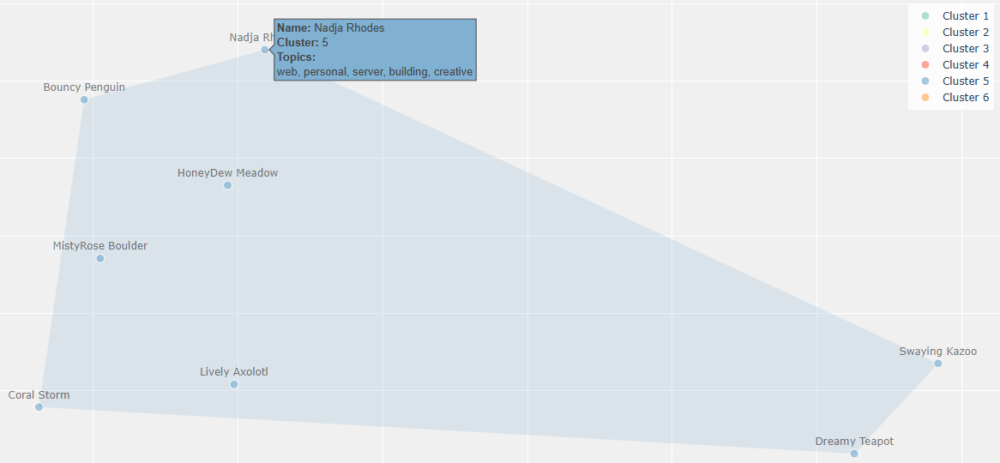

import dimred from '../assets/rc-batchviz-dimred.svg?raw';
import embedding from '../assets/rc-batchviz-embedding.svg?raw';
import pipeline from '../assets/rc-batchviz-pipeline.svg?raw';

# Introduction

_Screenshot of my cluster from the final visualization created. My batch-mates are pseudonym-ized._

In this post, I'll explain how I used some fundamental machine learning techniques to visualize the interests of my (anonymized) batch-mates at the Recurse Center (RC), at the beginning of our Winter 1, 2024 (W1'24) batch. This project demonstrates:

- Converting text into numerical representations (embeddings)
- Simplifying complex data while preserving relationships (dimensionality reduction)
- Finding natural groupings in data (clustering)
- Visualizing multidimensional data with Python's [`plotly`](https://plotly.com/python/) library

My goal for this post is to provide an accessible explainer for this project, whether you are new to machine learning or just curious about analyzing text data!

_Disclaimer_: This was a quick, fun exercise that I did to warm up my coding muscles at the beginning of batch. As such, I didn't spend any additional time on improving final outputs here. Aside from the general pitfalls of attempting to group individuals by algorithm, expect the results to be kind of wonky and not tuned for accuracy!

For more on RC, check out the first few paragraphs that I wrote [here](/blog/2024/11/rc-reflection-1).

# The What

"batches of batch" is a lightly interactive 2D/3D visualization that attempts to show how my batch-mates' interests relate to one another, based on the content of their welcome posts and week 1 introductions. The full source code is available on GitHub: [iconix/rc-batchviz](https://github.com/iconix/rc-batchviz).

This viz was inspired by the "Advice and Introductions" call on the first day of W1'24, where RC faculty advised us to take notes because:

> It's very easy to forget who said the thing you were curious about once everybody's gone

This sparked a fun idea: what if I could create a durable "map" of everyone's interests based on what they shared that day? This could theoretically help us all find potential collaborators and encourage connections.

As a spoiler, here's what the live visualization looks like, in 2D (easier to manuever on bigger screens):

<iframe src='https://iconix.github.io/rc-batchviz/interactive_viz.html' title='batches of batch: a UMAP Projection with HDBSCAN Clustering and `tfidf` Topics' width='860' height='500'></iframe>

It shows batch-mates clustered by color, and hovering over points reveals batch-mate pseudonym, cluster assignment, and topical keywords for the cluster. You can also zoom and pan the visualization to be better see the dense clusters (see the controls at the top right). Also, one could toggle a flag on the generating script to render this in 3D (`--components 3`).

# The How

At a very high level:

> I manually scraped some text data, then pushed it through an embedding model + a dimensionality reducer + a clusterer + a topic modeler.

Neat but huh?! My batch-mate, Karen, basically replied when I gave this description in my daily RC check-in post. Fair enough!

### Step 1. Gather text

> `some text data` ➤ my notes from the "Advice and Introductions" call + W1'24 welcome topic posts

This bit is straightforward enough. I copy-pasted all the welcome posts from our messaging platform Zulip, then added my own notes from the call, to a Google Sheet and exported it to a CSV.

### Step 2. Turn text into numbers (embeddings)

> `pushed it through an embedding model` ➤ converted the text into lists of numbers that capture features (relationships and patterns) from the original data

Here's where the ML 'magic' starts! Modern machine learning models can translate text (discrete, symbolic, context-dependent text) into a continuous representation that other models, and computers in general, know how to process: that is, a ton of numbers (also known as vectors). The numbers aren't random, either: they are tuned to encode similarity and relationships between different texts. An embedding model is what performs this encoding process.

Here's a simplified visualization of how embeddings behave in 2D:

<Fragment set:html={embedding} />

In this example, instead of trying to understand "cat" as a word, the model understands it as a point in multidimensional mathematical space. Words with similar meanings or closer relationships appear closer together - so "cat" and "dog" are closer together than "cat" and "airplane" are.

An interesting effect of this is that since they are numbers with meaning, you can do math on words essentially, like measure [cosine similarity](https://en.wikipedia.org/wiki/Cosine_similarity). Pretty neat!

The embedding model learns these relationships by seeing lots and lots of examples. Nowadays, text-based models are taught on essentially as many books and as much of the internet as possible (for better or worse). And the teaching occurs by the model predicting some objective (like predicting what words might appear nearby - aka within the context of - the word "cat"), then slightly adjusting its internal numbers ("weights") to do better at the next round of prediction. Doing better at this objective results in tweaking the numerical representations for co-occurring text to be more and more similar.

It is pretty amazing that models trained from scratch start by making predictions totally at random and then refine from there. If interested in diving deeper into the details, this prediction and adjustment cycle is known as [gradient descent](https://en.wikipedia.org/wiki/Gradient_descent).

Anywho, I didn't have to teach these models from scratch here. Instead I used a pretrained, open-source neural network called Nomic Embed (`nomic-embed-text-v1.5`, to be exact). This model was chosen because it is [available on the Hugging Face model repository](https://huggingface.co/nomic-ai/nomic-embed-text-v1.5), which makes usage simple, and it has strong performance in academic benchmarks (outperforming OpenAI's paid embedding model, [thanks to how it was trained](https://www.nomic.ai/blog/posts/nomic-embed-text-v1)). It can also handle longer text sequences with its 8,192 token context window, although that wasn't necessary for this project.

The Nomic Embed model converts each person's associated text data into a 768-dimensional vector - meaning each person, and ideally for our purposes, their interests, are represented by 768 numbers!

### Step 3. Simplify the numbers (dimensionality reduction)

> `+ a dimensionality reducer` ➤ an algorithm that takes high-dimensional data and creates a meaningful low-dimensional representation

So now we have lists of numbers imbued with semantic meaning. These lists of `K` numbers represent the text they encode in `K`-dimensional space.

`K` is usually a fairly big number - like a multiple of 128. For `nomic-embed-text-v1.5`, `K=768`. So, how to make sense of this 768D web of words? One approach is to "flatten" this web into a simpler map, in a lower visual dimension (2D or 3D), which preserves the most important connections. Think of it like making a visual map of the Earth - you lose some information, but the important relationships (like which countries are near each other) stay mostly intact. This technique is called dimensionality reduction.

[UMAP](https://umap-learn.readthedocs.io/en/latest/), or Uniform Manifold Approximation and Projection, is the particular algorithm I used in this project for dimensionality reduction. UMAP is good at preserving both local and global structure in the data, which should allow the reduction to generalize better. It also tends to work well with the high-dimensional embeddings produced by modern language models.

Like other machine learning approaches, dimensionality reduction involves learning patterns from data. UMAP uses techniques similar to neural networks (e.g., gradient descent!), optimizing a mathematical objective that balances preserving local and global structure.

Here's another simplified visualization, this time for dimensionality reduction:

<Fragment set:html={dimred} />

Note that some relationships between points are distorted in the projection due to information loss. For example, the tight cluster in 3D gets somewhat dispersed in 2D.

You may wonder: what do the dimensions mean after UMAP is applied? Unlike other methods like [Principle Component Analysis](https://en.wikipedia.org/wiki/Principal_component_analysis) (PCA), where dimensions can sometimes be interpreted, UMAP dimensions don't have inherent meaning. Instead, they represent abstract combinations of features that UMAP found useful for preserving the important relationships in the high-dimensional space. What matters is the relative positions and distances between points, not the specific coordinate values.

### Step 4. Find groups (clustering)

> `+ a clusterer` ➤ an algorithm to identify natural groupings in the simplified number space

Once we have our 2D or 3D representation, we can find natural groups in the data with a clustering algorithm called [HDBSCAN](https://hdbscan.readthedocs.io/en/latest/) (Hierarchical Density-Based Spatial Clustering of Applications with Noise).

HDBSCAN works by:

1. Finding areas where points are densely packed together
2. Identifying these dense regions as clusters
3. Assigning points to their most likely cluster

HDBSCAN was chosen over simpler clustering algorithms like [k-means](https://en.wikipedia.org/wiki/K-means_clustering) because it doesn't require specifying the number of clusters in advance (which we don't know!), can identify noise points or "outliers" that don't belong to any cluster, and can find clusters of varying densities and shapes.

Clustering is a form of unsupervised machine learning, where the algorithm learns to identify patterns and structure in data without being given explicit examples of what constitutes a "correct" grouping. HDBSCAN learns to recognize dense regions in the data that likely represent meaningful groups.

### Step 5. Understand group themes (topic modeling)

> `+ a topic modeler` ➤ an algorithm to extract key themes and terms that characterize a group of documents

In this step, text makes a comeback!

For each cluster, we want to understand what common themes (that ideally align with interests) bind it together. We use a technique called topic modeling to automatically extract key themes for each cluster from the underlying text data that now belongs to a specific cluster.

As an exercise and for comparison with automated methods, here is how I manually interpreted the clusters by interest:
- Cluster 1: Audio/Visual & hardware
- Cluster 2: CS fundamentals & machine learning
- Cluster 3: Systems programming & hardware
- Cluster 4: Graphics & game development
- Cluster 5: Web development & creative coding
- Cluster 6: Visual tools & applications

Topic modeling is another form of unsupervised machine learning that learns to discover abstract topics that occur in a collection of documents. The algorithm identifies which words tend to appear together frequently and uses this information to infer underlying themes or topics.

The results that I liked best here come from a modified [TF-IDF](https://jaketae.github.io/study/tf-idf/) method, despite it being considered an old school method. The script has a flag (`--topic-method`) that can be changed to run more modern methods, like KeyBERT.

I did a bit more comparison between the automated topic labeling methods available in my script, versus my own interpretation of the clusters:

- TF-IDF tends to surface individual technical terms (like "music", "cs", "game") but lacks broader context. It is good at identifying key technical concepts (which nicely aligns with the goal for this project) but misses thematic connections.
- [KeyBERT](https://maartengr.github.io/KeyBERT/) often captures more meaningful phrases ("mobile app development", "socket programming") but can be inconsistent and sometimes focuses on irrelevant social aspects.
- Representative sentences (via [sentence-transformers/all-MiniLM-L6-v2 · Hugging Face](https://huggingface.co/sentence-transformers/all-MiniLM-L6-v2)) tend to highlight general programming enthusiasm and social aspects rather than specific technical focuses. This makes sense given they are drawn directly from welcome posts where people often express excitement about joining RC.

So how did topic modeling do? Overall, it often "misses the forest for the trees." Human interpretation remains valuable for synthesizing coherent, meaningful cluster labels that capture the essence of the grouped content. It just doesn't scale as well!

### Step 6. Visualize groups

The final step uses [Plotly](https://plotly.com/python/) to create an interactive visualization where:

- Points represent individual batch-mates
- Colors indicate cluster membership
- Distance between points represents similarity of interests
- Hovering over points reveals pseudonyms, cluster membership, and key topics
- The visualization can be zoomed and panned to explore different regions

The interactive bit of the visualization allows for better visualizing the clusters, which can be a bit dense, as well as exploration of the relationships between different clusters and individual data points.

Quick asides: The only data point without a pseudonym is my own: `Nadja Rhodes`. I also had lots of dialogue with [Claude](https://claude.ai/) in order to generate the Plotly code.

### All together now

Here's a flow chart that puts the full pipeline together with a bit more detail. Data flows through the different steps, and each step performs a specific task, as described in the steps above.

<Fragment set:html={pipeline} />

The first full pipeline run, from CSV, takes about a minute and a half on my laptop (no GPU) via the Python script.

# The Results

So how representative of interests is this viz, really? Across the board, not terribly but also not spectacularly. The clusters seem fairly coherent after a brief inspection, but the topic labels to help with interpretation are lackluster.

Although, as seen in the first screenshot of this post, my particular cluster with topics `web, personal, server, building, creative` feels pretty spot-on ("works on my ~~machine~~ data" *\*closes laptop\**).

Here are some other interesting patterns and data artifacts that I found:

- A "no welcome post" cluster (Cluster 4) emerged containing batch-mates who did not write a welcome post, clearly showing how the model picked up on more than just interests. If it can cluster around missing data, what else may it have picked up on?
- Clusters are not set in stone and can change between runs, due to elements of randomness in both the UMAP and HDBSCAN algorithms (UMAP initializes with a random state and makes random choices during optimization; HDBSCAN does some random tie-breaking and can vary how it builds its cluster hierarchy)
- Cluster boundaries are highly dependent on the HDBSCAN parameters selected. Subjectivity, interpretation, and experimentation were important, and it wasn't just "plug and play" - I used my own judgment to tune parameters.
- The meanings of clusters can be tricky to pin down automatically
- Some information is inevitably lost during dimensionality reduction:
  - Data points that clustered together in higher dimensions could end up far apart in the 2D/3D visualization
  - Distinct groups might get merged if their distinguishing features were lost
- Topics like `rap` showing up (Cluster 3) are likely due to how the text tokenizer breaks up words. I checked, and no one mentioned rap music. So an interesting artifact!
- Love my pseudonym generator 😍 Let's goo `Exuberant Teapot`

Future improvements could include:

- Incorporating data from another Zulip scrape on actual interactions and collaborations during batch and seeing how the clusters change
- Adding more interactive features and modifiable parameters to explore the data and techniques
- Providing more raw data on hover: interests, background, and whether or not they filled out each data source, etc.
- Using Sparse Autoencoders (SAEs) to potentially get more interpretable features from the embeddings
  - SAEs could help identify which aspects of the embedding space are most important for distinguishing between different interests
  - This could provide more insight into why certain batch-mates are clustered together
  - SAEs are a hot research area in interpretability (see [Anthropic](https://transformer-circuits.pub/2024/scaling-monosemanticity/index.html) and [OpenAI](https://openai.com/index/extracting-concepts-from-gpt-4/)) that I have little knowledge but growing interest in!

### Notes on implementation

This project used the following Python packages:
- `transformers` and `torch` for loading and running the embedding model
- `umap-learn` for dimensionality reduction
- `hdbscan` for clustering
- `plotly` and `scipy` for interactive visualization
- `pandas` and `numpy` for data processing
- `parquet` and `datasets` for efficient data storage of embeddings
- `keybert` and `sentence-transformers` for testing out more modern topic modeling methods

Here is a direct link to the [final visualization](https://iconix.github.io/rc-batchviz/interactive_viz.html). The full implementation is available on GitHub: [iconix/rc-batchviz](https://github.com/iconix/rc-batchviz). I don't share the underlying data used because it was shared in internal communications.

That's all, folks! Thanks for reading.

# Kudos

Special thanks to:

- My W1'24 RC batch-mates for just being curious, brilliant people all around
- My batch-mate [Karen Aragon](https://www.karenaragon.com/) for showing interest in this project and how it works! I used our conversation as motivation to solidify some understanding in my own head, and it also encouraged me to write this post and document the work.
- RC faculty and their A-1 workshops for the consistent inspiration
- [Claude](https://claude.ai/) by Anthropic for generating the SVG diagrams used in this post to visualize concepts, as well as chatting with me to generate the Plotly scatter plot code 🤖 All other content was composed by me.

# Resources

In machine learning nowadays, things change so fast that finding the most up-to-date resources, pretrained models, and libraries can be half the battle. The following resources helped me out a lot in this respect:

- [A Pokémon embeddings project that helped me select particular models and algorithms](https://minimaxir.com/2024/06/pokemon-embeddings/) by Max Woolf
- [This topic modeling article as another source of code inspiration](https://archive.ph/kXaSs)
- [A deep dive into embeddings](https://vickiboykis.com/what_are_embeddings/) by Vicki Boykis
- [Understanding UMAP](https://umap-learn.readthedocs.io/en/latest/how_umap_works.html)
- [Nomic Blog: Introducing Nomic Embed: A Truly Open Embedding Model](https://www.nomic.ai/blog/posts/nomic-embed-text-v1)
- [A "scrollytelling" beginner's guide to dimensionality reduction](https://dimensionality-reduction-293e465c2a3443e8941b016d.vercel.app/), which I actually found after implementing this project
