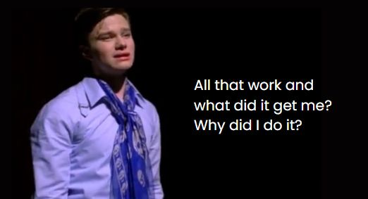

_Author's note: writing this blog post made me realize that my brand new-ish site could use more sophisticated blog post styling... like a table of contents, and footnotes. Looking forward to implementing these things! Please bear with me for now though :)_

---

I've dedicated many hours over these past 2 weeks to a program that I only recently came across, during batch at the [Recurse Center (RC)](/blog/2024/11/rc-reflection-1). The program is called [Tiled](https://www.mapeditor.org/), an editor for tile-based 2D maps.

I need it to develop maps for my top-down, retro-style game world, which I plan to embed in this site's homepage and hook up to this site's navigation (fun aside: [Pokémon Gold](https://www.youtube.com/watch?v=RII_J_F4ZxQ&list=PLwdomizKnSjvEj7Es-khScxhFFCkRNdSB) was a cornerstone game in my childhood and is my main inspiration). But I didn't know anything about how these sorts of maps are constructed. It's a whole thing (as most things are)!

I found that game tutorials would often skip over this bit and assume that you either have a map ready to go or will just use theirs. So, this is what I had to do to build my first map.

**But wait, why build maps out of tiles in the first place?**

While I am building a nostalgic RPG-style town, tile-based maps are fundamental to many types of games: from classic platformers to modern roguelikes, dungeon crawlers, and city-builders. The grid system that tiles provide makes designing levels more systematic and efficient, compared to placing individual objects. It's kind of like digital LEGOs: one can quickly build complex worlds by combining and reusing basic pieces. It is also more memory- and bandwidth-efficient, since instead of storing one massive image with repeated elements, games can store a small set of unique tiles and just track where each one should be placed.

Let's also take a moment to define some helpful terminology:
- **Tiled**: the aforementioned program; a free, open-source 2D map/level editor for tile-based games
- **Tile**: a small, reusable image; the building block and the base unit of a tile-based system (ok, i guess there's also the more basic _pixel_)
- **Tileset**: a collection of unique tiles; saved as an XML file with a .tsx extension in Tiled, and also exists as an image file (.png or .jpg)
- **Tilemap**: a game world composed of references to tiles from the tileset; saved as an XML file with a .tmx extension in Tiled, or exported as a JSON file with a .tsj extension in Tiled
- **Texture**: an image used to add visual detail or surface characteristics, often in 3D games
- **Sprite**: a bitmap image used as an independent graphical object, often in 2D games
- **Texture atlas**: a large image that combines multiple smaller textures or sprites into a single file. Despite its origins in 3D, it is commonly used as a performance optimization for 2D games.
- **Layer**: a technique for defining the draw order of tiles, in order to create depth and a visual hierarchy, especially in 2D; can also provide abstraction and functional separation; see also "layers" in image editing software like Photoshop

I had a lot of trouble grepping the difference between a _texture atlas_ and a _sprite sheet_, with sprite sheet being the more common term that I was familiar with before this. The difference is fairly subtle, as both present as a single image file with multiple frames. I'll return to this later.

**Step 0-a.** Before I could start designing maps, I needed artwork. I could create the art, if so talented. I am not so talented, in which case, art usually comes in the form of an _asset pack_ from an artist, free or paid, which can be found in places like [itch.io](https://itch.io/game-assets), [kenney.nl](https://kenney.nl/), and [fab.com](https://www.fab.com/) (which I have been told is more of an archive, now that Epic Games [bought it](https://www.epicgames.com/site/en-US/news/sketchfab-is-now-part-of-epic-games)). Anyway, finding assets is not a simple process! I had a pixelated, nostalgic 90s aesthetic in mind, with a host of buildings and landmarks and non-playable characters (NPCs) reflecting different elements of my (mostly professional) life around a small town. With such specific art style and game elements in mind, I had to do some spelunking for appropriate art. I did not settle on assets as Pokémon-like as I imagined, but this [Pixel Quest asset pack](https://itch.io/s/132071/help-this-pack-reach-a-goal) is still pretty charming.

**Step 0-b.** The Pixel Quest asset pack probably has over 100 elements inside, and I think I am being conservative there (all for a mere US$3.60)! I only needed a subset of these for my map, so I gathered the individual assets I needed and "packed" them, using a 7-day pro trial of [TexturePacker](https://www.codeandweb.com/texturepacker), into 2 texture atlases: one for assets with dimensions of 16x16 pixels, another for 32x32 pixels.
- I am fudging the truth here actually. _Ideally_, I would have actually done this thing this early in the process. In reality, I learned about texture packing much later on. And I am not actually sure what it would take to really know all the assets you'll need for a map ahead of time, so that you can pack them before usage. For me, I had to build it and see! The problem with building first is that my map was created referencing old asset files, so once I had my new asset files, I had re-create the entire map :( There must be a better way! If anyone knows, uh, please let me know.
- Also in retrospect, because I use the images as texture atlases and _not_ as sprite sheets, I could have combined the assets of different dimensions into one file. So that covers one difference between the two concepts!

**Step 1.** OK- now we can finally do some tiling! This involves quite literally placing your tiles on a grid.

**Step 1-a.** First, I chose a map size (by number of tiles) and a base tile size. But even just this step took me a couple tries to get right: to determine the sizes, I pulled up a reference map from the asset artist in MS Paint and counted 32x32 pixels per tile; so I thought, surely my tile size is... 32x32. It turns out that many tiles in my tileset are actually 16x16, meaning when rendered on a 32x32 map, I would see the target tile in one corner of the grid cell, plus 3 neighboring tiles. Between this and misunderstanding the purpose of layers, I had no idea what was going on for a while... until I was able to pair for 20 minutes with a more experience game developer in my RC batch (thanks, Alex!). And then voilà! I was finally able to place a single tile in a cell of my grid satisfactorily.

**Step 1-b.** Next up, I created Tiled tilesets (.tsx files) from tileset images (.png files, typically). This involved importing a source image, giving it a name (that becomes a key in my code later on!!), making sure I left the "Embed in map" option *un*checked, and specifying tile dimensions in yet another place. One may or may not also have to tweak the "Margin" and "Spacing" settings, depending on your asset pack (fortunately, I did not have to do this)!
- There are multiple ways in which this step felt like a magic incantation. How am I supposed to know that the name I set here in this dialog box will become a prominent key in my code... what does embedding in the map mean... why do we have another tile size to set, when we already set a tile size when creating the map?
- So now, I _think_ there are two tile size settings so that a single map can support different-sized tiles... it seems best to set the map's tile size to the smallest common size in your tileset. Such that, if you have a map with base tile size of 16x16, you can treat 32x32 tiles as 2x2 tiles on the grid.
- Tutorials for [Phaser](https://phaser.io/), the HTML5 game framework that I am using, kept telling me to "Embed in map" without any further explanation, while Tiled suggested that embedding was not recommended. So which one should I do?? It turns out the answer is game engine or framework specific. Phaser cannot handle external tilesets, so they need to be embedded. However, there's a subtle difference between embedding a tileset into your saved .tmx file vs embedding it into your exported .tsj file. Once embedded in a .tmx, it becomes more difficult to share and manage the tilesets across maps. So, it is best to wait to embed in your .tsj file, which is an option you can enable by going to `Edit` -> `Preferences...` -> `General` -> `Export Options` -> `Embed tilesets` in Tiled (1.11). And while you are there, save yourself some future trouble and go ahead and enable `Resolve object types and properties`... I found out the hard way that I needed this option in order to give my Phaser code access to custom properties that I added to my tilesets. We'll come back to custom properties.
- Another engine-specific quirk that I will mention here: Phaser does not know how to use "compressed" Tiled layer formats. So it requires either csv or base64 uncompressed format.

**Step 1-c.** Now I could finally "paint" by placing tiles from my new tilesets on my empty tilemap. If you have a large map, there are tricks to make this painting less granular, like texture brushes and some, frankly, heinous feature called [automapping](https://doc.mapeditor.org/en/stable/manual/automapping/), which is like the most complicated find-and-replace engine you will ever come across. But I just stuck to the (1) stamp brush and (2) bucket fill tool, with some occasional rectangular select and eraser, for my tiny town.
- But actually wait - don't just start painting yet! Let's learn about layers first...

Layers are essential for creating depth and organizing your game world. Tiled offers **three fundamental layer types**:
1. A **tile layer** provides the core grid system for placing tiles. Elements must snap to the grid. Examples: ground tiles, walls, paths.
2. An **image layer** holds a single large graphic, without tiles, which could be helpful for non-tiled backgrounds or overlays. Example: a distant mountain backdrop in a side-scrolling game.
3. An **object layer** is best for elements in your game that will interact with your game engine (yes, we will code someday!). Elements do not need to snap to the grid. Examples: coins, power-ups, NPCs, spawn points.

How many layers I needed and for what kept evolving as I discovered new issues with my hierarchy 😵‍💫 Nothing is straightforward around here! From accidentally overwriting tiles when I really wanted them to overlap, to wanting to un-snap some elements off of the grid, to ensuring my character could walk behind tall things like trees or buildings. I guess this is kind of like coding, now that I think about it, with its layers (heh) of abstraction. But refactoring here is a lot more annoying, IMO... I finally settled on 5 layers, from bottom to top:
- **Ground** provides the base terrain colors: in my map, either green for grass or brown for path.
- **Ground Decoration** adds texture and detail to the terrain, like the edge of a path, or rocks and flowers.
- **World** is where the character resides, as well as any parts of elements that the character can collide with. Note that i said "parts" - with a tree, the character would be expected to bump into its trunk, but because the branches and leaves are above her head, we don't expect collision there.
- **Above World** is above the character, including any parts of elements that should render above or in front of the character. So the top bit of the tree is here!
- **Objects** is for items that the character can interact with, as well as abstract concepts like spawn points. Interactivity can mean it animates or the character will be able to engage with it. In my map, these items also tended to be composed of a single 32x32 tile and not snap to the grid system.

Anyway, you'll want to decompose your map into layers before you start to paint. You may need to start painting anyway with an imperfect model and then iterate. Think about:
- What should your character be able to walk behind?
- What needs to be interactive?
- What elements need to overlap?

**Step 2.** Save your map as a .tmx file for any future map editing (note: Phaser does not use this file, or the .tsx files), then export your map as a .tmj file for use in Phaser. It is possible that some game frameworks do not require this export step: I would not know! Keeping these files together will make it easier for you to find them later.

---

So that's my experience so far with Tiled!

I can also write briefly about integrating with the HTML5 game framework, [Phaser 3](https://phaser.io/), although this is a topic with much better coverage elsewhere.
- What are these **custom properties** that I mentioned earlier? They are a way of attaching extra data to your tiles, objects, and layers. Your game engine can read them, and you can provide logic for how different elements should behave. For example, I added a `collides` property to all tiles and then set it to `true` whenever an element is meant to be impassable.
- How do these Tiled files and concepts **map to code**? You export your .tmx file as .tmj (JSON) for Phaser. The tileset names and layer names you set in Tiled become the keys you'll use in your code to load and create the map. Any custom properties you add to tiles/objects in Tiled become accessible as object properties in your code. Special elements placed in your Objects layer (like spawn points or NPCs) can be found via `map.findObject('Objects', obj => obj.name === 'Spawn Point')`. Your packed texture atlas consists of two files - a .png containing all of your sprites, and a .json mapping names to coordinates within that image. In code, you load both files together with `this.load.atlas()` and can then reference sprites by name (which I set via custom property in Tiled).
- Let's also quickly return to **texture atlases vs sprite sheets**. I already mentioned one difference is that texture atlases support assets of multiple sizes, unlike sprite sheets. A texture atlas also uses less memory and bandwidth, as an atlas is implemented to only draw each element once, while a sprite sheet redraws with every frame ([via](https://www.joshmorony.com/how-to-create-animations-in-phaser-with-a-texture-atlas/)). There are also some implementation differences between them in Phaser. Besides uniform dimensions, a sprite sheet expects all frames to be referenced by index, which can be less intuitive. A texture atlas uses a separate data file (JSON or XML) to describe and name frame positions, which provides a nice organizational separation, and also allows frames to have varying sizes and positions within the image.
- When using [TexturePacker](https://www.codeandweb.com/texturepacker) for tiled maps, change the `Packing` -> `Algorithm` from `MaxRects` to `Grid / Strip` (or even `Basic`, I think), so that the original tiles line up correctly in the grid. It will be a less efficient pack in terms of whitespace, but it will be usable in Tiled!
- Don't expect animations created within Tiled to port over the Phaser. They don't! I had to re-sequence the frames in Phaser.

## Results

Feel free to visit the map I built with ~approximately these steps here: https://iconix.github.io/rc-impossible-town/nadj-land/.
- Easter egg: try approaching the door on the green house
- Beware of some mysterious vertical bars if you're on mobile: it's a rendering quirk that I've decided to live with, for now

Well, I'm off to build a bigger map. Thanks for reading!

## Resources
- [Tiled Documentation — Tiled 1.11.0 documentation](https://doc.mapeditor.org/en/stable/) (don't sleep on the official docs, like I did!)
- [Tiled Map Editor Tutorial Series — GameFromScratch.com](https://gamefromscratch.com/tiled-map-editor-tutorial-series/)
- [Modular Game Worlds in Phaser 3 (Tilemaps #1) — Static Maps](https://medium.com/@michaelwesthadley/modular-game-worlds-in-phaser-3-tilemaps-1-958fc7e6bbd6)
- [How to create sprite sheets for Phaser 3 with TexturePacker](https://www.codeandweb.com/texturepacker/tutorials/how-to-create-sprite-sheets-for-phaser3)
- [A Noob's Guide to Loading Tiled Tilemaps in Phaser 3 @ Playful Game Developmet Blog by Ourcade](https://blog.ourcade.co/posts/2020/phaser-3-noob-guide-loading-tiled-tilemaps/)
